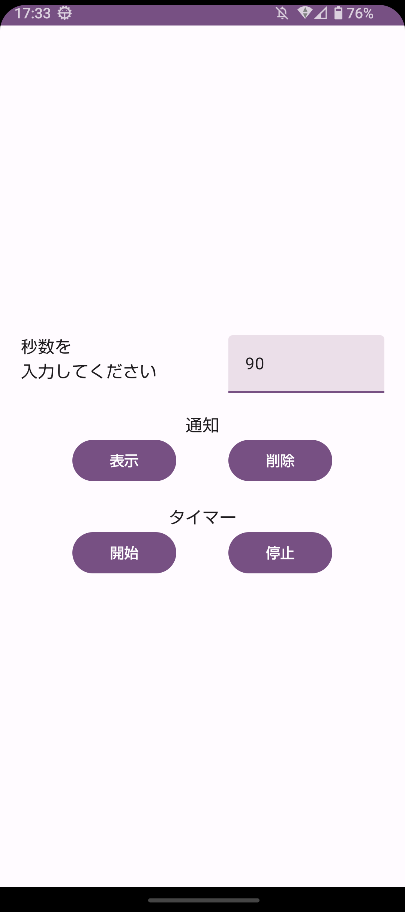
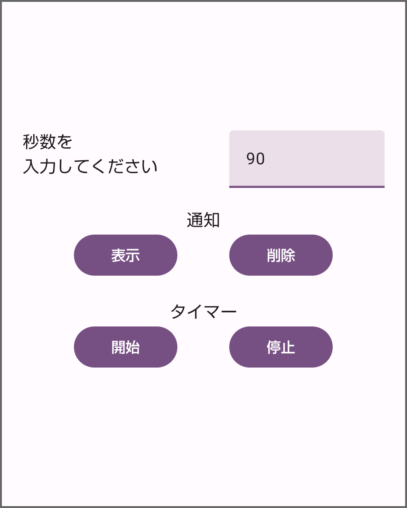
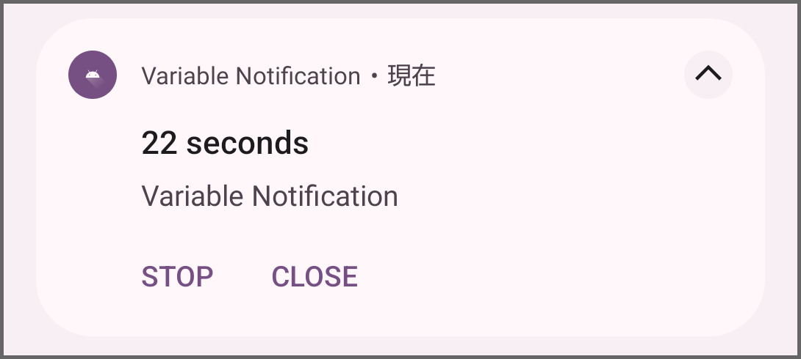
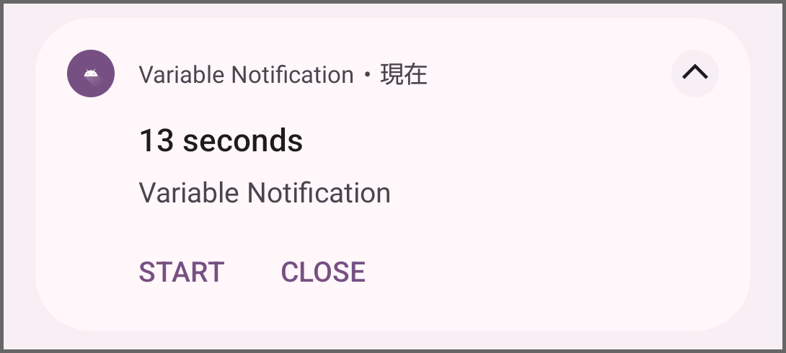

# android-compose-variable-notification(最小限の実装)
1秒ごとに更新する通知の実装
## 想定環境
使用言語: Kotlin
Android Studio Giraffe | 2022.3.1
OS: Windows 11
minSdkVersion: 26
targetSdkVersion: 33

## Zennの記事
このコードを[Zennの記事](https://zenn.dev/kei_no_suke/articles/5fe5829c306a10)で紹介しています。
## アプリのメイン画面

## 実行手順

### タイマーを開始する手順

1. 入力欄に秒数を入力します。
2. 通知の表示ボタンを押して通知を表示します。このとき、通知に表示される秒数は「0 seconds」となります。
3. タイマーの開始ボタンを押してタイマーを開始します。
4. 通知を見ると秒数の数字が変化し、タイマーの残り秒数を表示します。

### タイマーを停止する手順
通知から停止する場合
1. 通知のSTOPボタンを押す

アプリのメイン画面から停止する場合
1. タイマーの停止ボタンを押す

### 通知を閉じる手順
通知から閉じる場合
1. 通知のCLOSEボタンを押す

アプリのメイン画面から閉じる場合
1. 通知の削除ボタンを押す

↑タイマーが作動しているときの通知

↑タイマーを停止しているときの通知

## 注意すること
ForegroundServiceを伴う通知のため、アプリを終了しても通知は表示され続けます。そのため、通知を閉じたい場合はアプリもしくは通知のボタンを押すことで通知を閉じるようにします。
